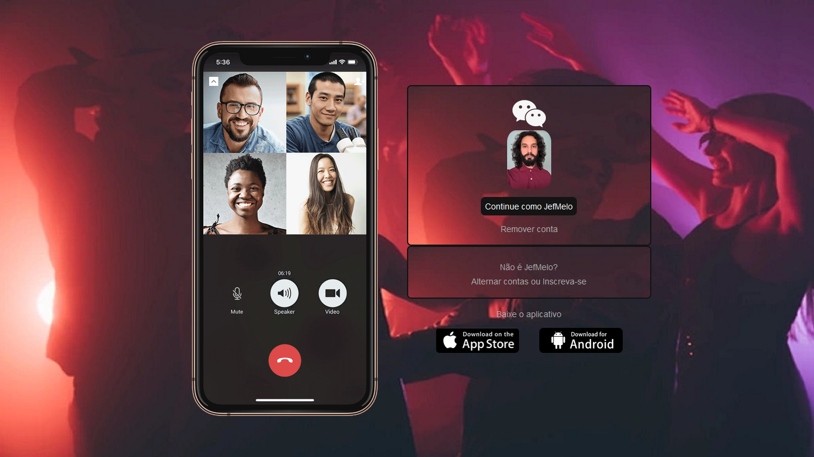

# Página inicial do Wechat

Olá!  
Projeto baseado na página de login do [wechat](https://www.wechat.com/pt/). Projeto desenvolvido para como prática de frot-end utilizando html e css.  

## Referências Básicas

* [HTML básico](https://www.w3schools.com/html/)
* [CSS básico](https://developer.mozilla.org/pt-BR/docs/Web/CSS)

## Print Exemplo

